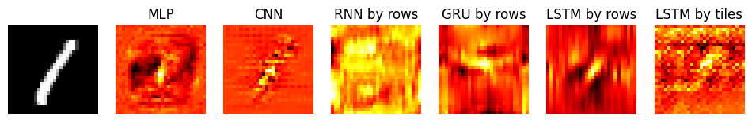
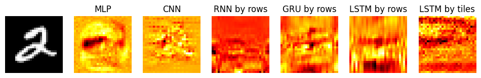
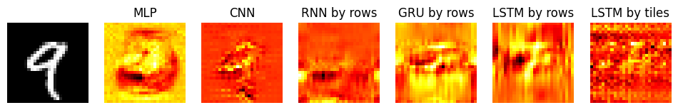
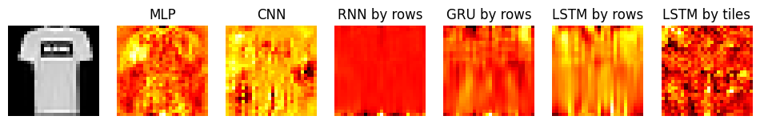
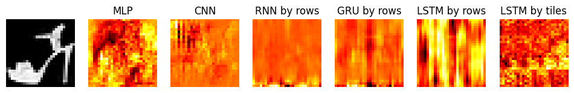
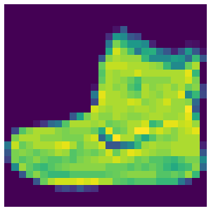

# RNN / LSTM / GRU
Compare the accuracies and saliency maps between different models

## MNIST
| Model         | Accuracy |
|---------------|----------|
| MLP           | 0.961    |
| CNN           | 0.988    |
| RNN by rows   | 0.964    |
| GRU by rows   | 0.982    |
| LSTM by rows  | 0.987    |
| LSTM by tiles | 0.966    |

## Fashion MNIST
| Model         | Accuracy |
|---------------|----------|
| MLP           | 0.883    |
| CNN           | 0.881    |
| RNN by rows   | 0.850    |
| GRU by rows   | 0.881    |
| LSTM by rows  | 0.869    |
| LSTM by tiles | 0.857    |

## Cute Tiling Visualization

